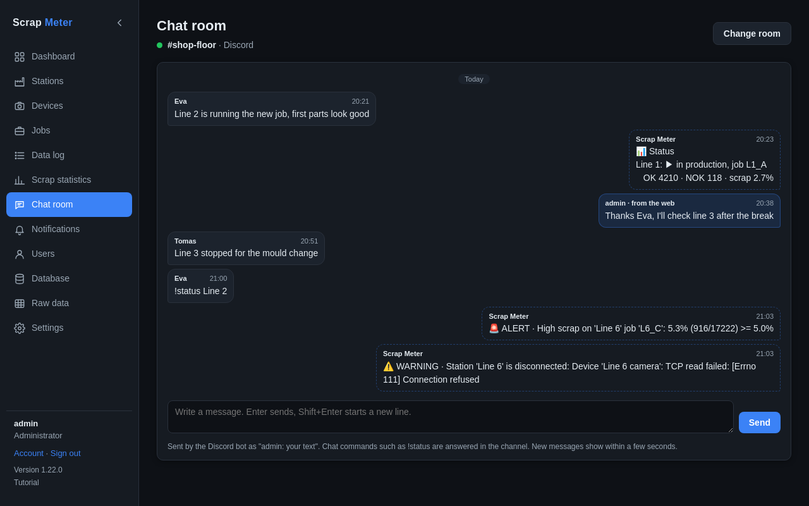

# Chat room

One messenger chat that everyone can read and write in from the web: a
Discord channel, a Telegram chat, or (with the developer options) a WhatsApp or
Signal group.

- An **administrator** picks the chat with **Choose the chat room**.
- Messages from the web go out with your name in front.
- What arrives in the chat, and what the app sends there (alerts, command
  replies), shows here; the history is kept.
- Chat commands such as `!status` written here are answered in the chat.

More: [Chat room](../user-guide.md#chat-room).
