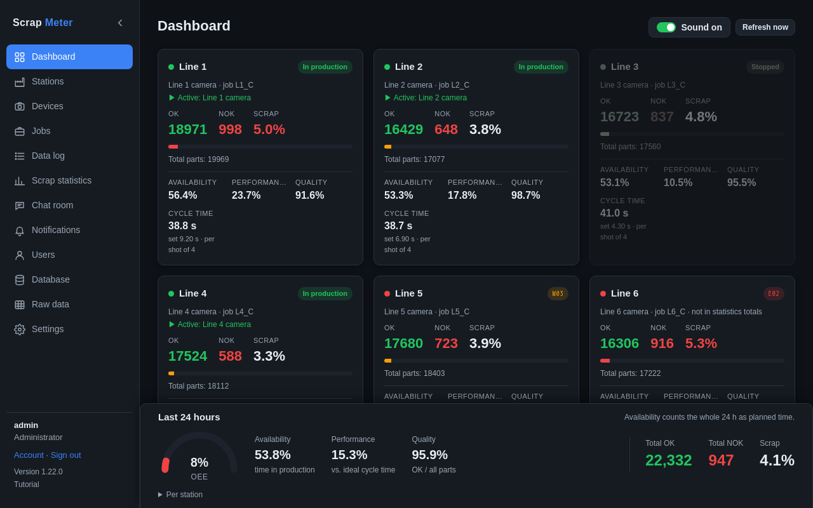

# Dashboard

The dashboard shows one block per station, refreshed every few seconds.

Each block shows:

- the **name** and a dot: green when its devices answer, red when not;
- the **pill** at the top right: *In production*, *Not in production* or
  *Stopped*, or a short [error code](error-codes.md) while a device has a
  problem (red for an error, amber while waiting);
- the devices and the **current job**, and which device is active;
- **OK**, **NOK** and **Scrap** of the current job since the last reset, with
  a scrap bar;
- availability, performance and quality over the last 24 hours and the
  **cycle time** (actual against set).

Grey blocks are stations that are not in production. Click a block to open
the [station view](stations.md#station-view).

**Last 24 hours** at the bottom shows the [OEE](oee.md) meter and the total
OK and NOK.

**Sound.** The dashboard plays a chime when a station starts or leaves
production, or its devices go offline or come back (not for muted stations).
The **Sound** switch at the top turns it off or on for this browser; browsers
only allow sound after the page was clicked once, and the switch says so.
