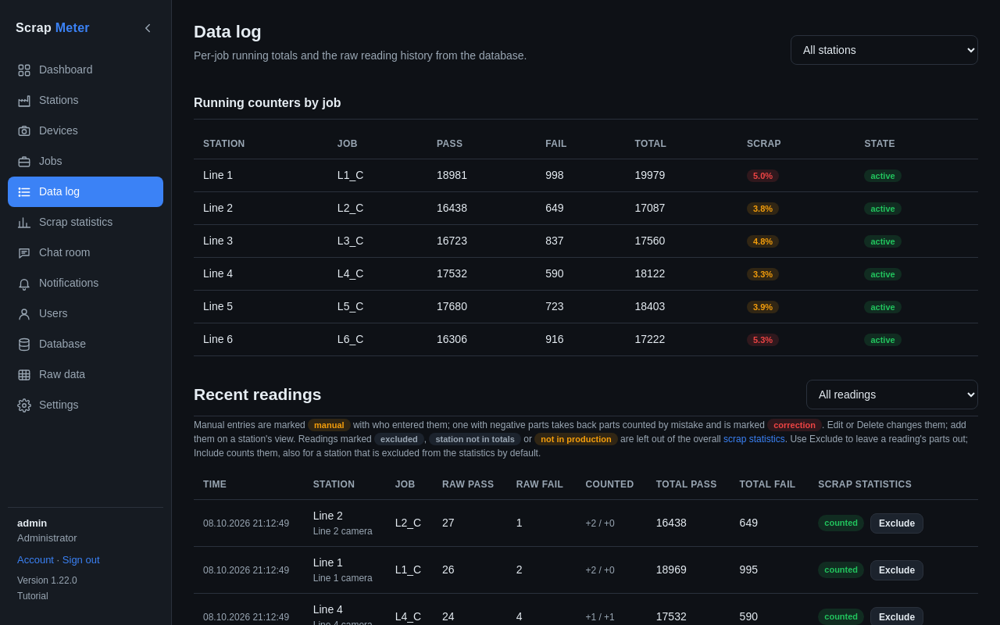

# Data log

The Data log shows the running totals per station and job and every reading,
as stored in the database.

Each reading says whether its parts count in the statistics: *counted*, *not
in production*, *excluded* (left out by a user), or *station not in totals*.
Users with *exclude_readings* can **Exclude** a wrong reading or **Include**
it again. Manual entries show who entered them and their note.

**Alerts muted and turned on** lists when a station's alerts were muted, by
whom and from where.

More: [Data log](../user-guide.md#data-log).
