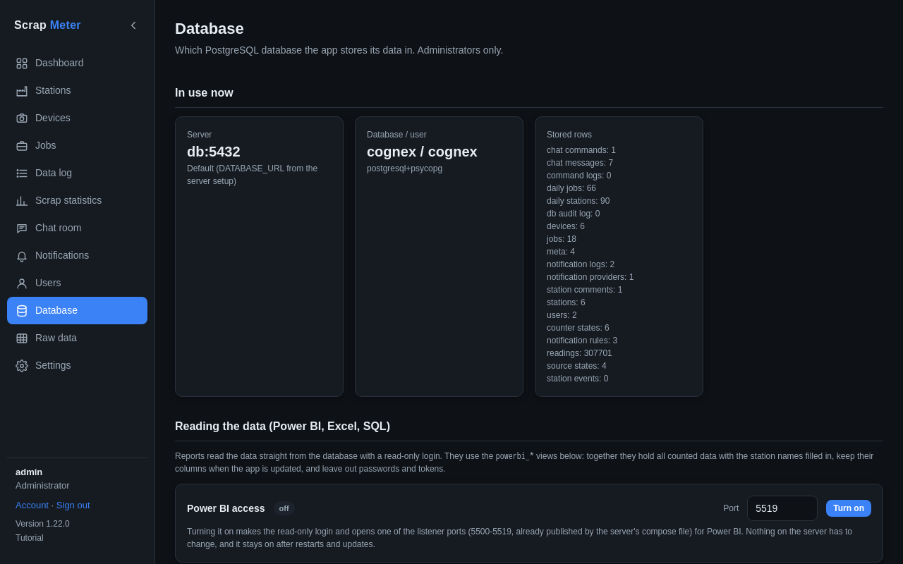

# Database, backups and Power BI

The Database tab is for administrators.

- **Database**: which database server the app uses.
- **Backups**: **Download backup** saves everything in one file, **Import
  backup** puts one back, and the automatic backup sends one to an FTP server
  on a schedule. The tab warns when the last backup is more than 7 days old.
- **Reading the data**: Power BI, Excel or SQL can read the data through a
  read-only login and ready-made views (`powerbi_*`), including daily
  figures. Switch on **Power BI access** to open a port for it.

More: [Database tab and backups](../user-guide.md#database-tab-and-backups),
[Reports](../reporting.md).
