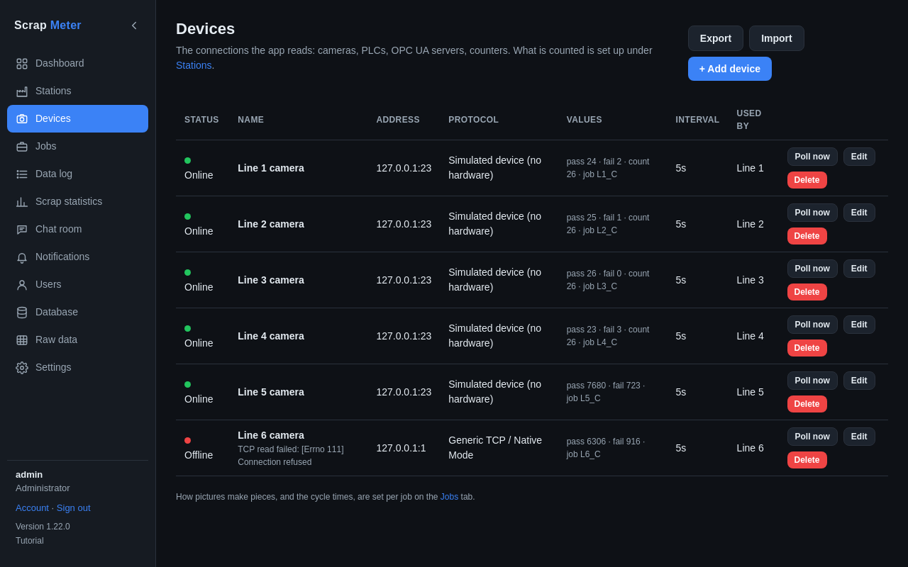

# Devices and protocols

A device is one connection the app reads. The Devices tab shows each one with
its state, address, protocol, its latest values and how often it is read.

Protocols:

| Protocol | For |
|---|---|
| Generic TCP / Native Mode | Cognex In-Sight cameras and devices asked for their counters over TCP |
| Cognex Data Channel (TCP) | Cognex Data Channel results |
| TCP listener / UDP listener | Cameras or PLCs that send a line of text to the app on their own |
| Modbus/TCP | PLCs, counters and gateways |
| SLMP / MC protocol, SLMP server | Mitsubishi PLCs: the app reads registers, or the PLC writes to the app |
| PROFINET (via gateway) | PROFINET devices through a gateway |
| OPC UA client | Any value of an OPC UA server, with security and login |
| Simulated device | Trying the app without hardware |

**Poll now** reads a device at once. A device that sends to the app gets one
of the listening ports (5100-5119 by default). Pictures and pieces: when a
camera takes several pictures of one piece, a **piece rule** on the job
turns pictures into pieces (see [Jobs](jobs.md)).

More: [Devices tab](../user-guide.md#devices-tab), [Protocols](../protocols.md).
