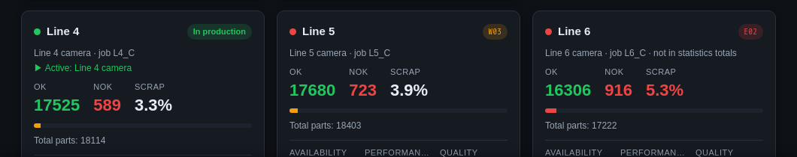

# Error codes

While a station's device has a problem, the dashboard pill shows a short code
instead of the production state. Hover it for the message; the station view
shows the code with the full message.

| Code | Colour | Meaning | What to check |
|---|---|---|---|
| W01 | amber | Waiting for the device to connect or send its first data (or just added) | Is the camera or PLC on, and set to send to the app's port? |
| W02 | amber | Waiting for the first value of a counter or job | The device answers but hasn't given that value yet |
| W03 | amber | The device is switched off (disabled) | Devices tab: enable it |
| E01 | red | A source's device was deleted | Stations tab: pick another device |
| E02 | red | Cannot connect: refused, unreachable or unknown address | Address and port, network, firewall |
| E03 | red | The device did not answer in time | Network, device busy |
| E04 | red | The connection was lost or closed | Cable, device restarted |
| E05 | red | The device's settings are wrong or incomplete | Devices tab: the device's settings |
| E06 | red | A value could not be read (address, node or register) | The register, node id or tag name |
| E07 | red | The listening port is taken by another program | Pick another port |
| E09 | red | Another error of the device | The message says which |

More: [Problem codes](../user-guide.md#problem-codes).
