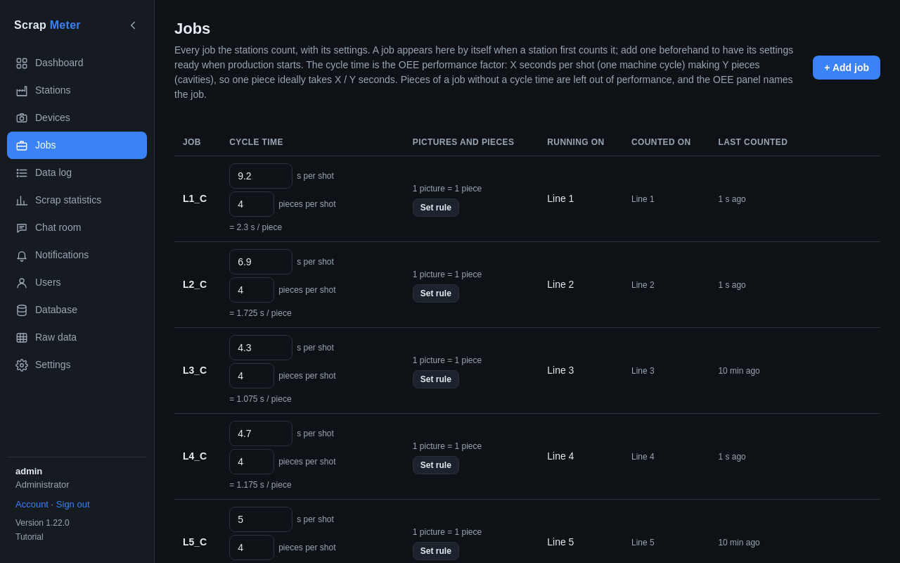

# Jobs

A job is what a station makes, e.g. a part number or recipe. Jobs appear by
themselves when a device reports one; the Jobs tab lists them all and lets you
add one before production starts.

For each job you can set:

- the **cycle time**: X seconds per shot of Y pieces (for multi-cavity
  moulds). The [OEE](oee.md) performance and the dashboard's cycle time use it.
- a **piece rule**: how many camera pictures make one real piece, and when
  that piece is OK.

More: [Jobs tab](../user-guide.md#jobs-tab).
