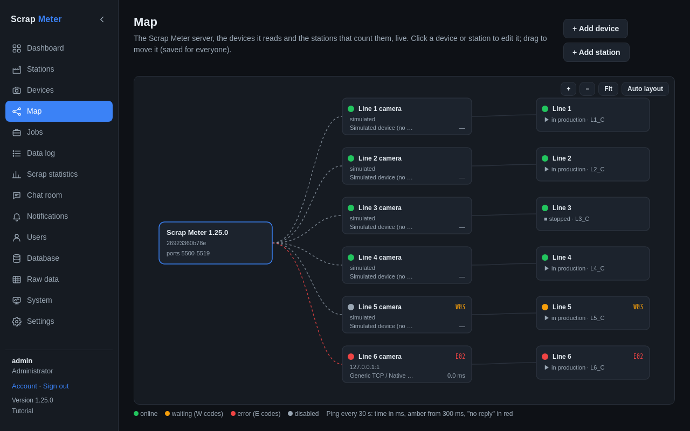

# Map and ping

The *Map* tab, after Devices, shows the Scrap Meter server, the devices it
reads and the stations that count them, live.

Each device shows its address, protocol, a status dot with the dashboard's
problem code and its ping time; each station its production state and job.
Click a device or station to edit it in the same form as on its tab; drag to
move it (kept for everyone), **Auto layout** to start again.

The app pings every device every 30 seconds (ICMP, or the time to open a TCP
connection where ICMP gets no answer). The time also shows in the **Ping**
column on the Devices tab and on the station view. Administrators turn it off
or change how often under **Settings → Ping devices**.

The alert rule **Device slow or not answering pings** sends a message after
3 slow (300 ms by default) or unanswered pings in a row, and once more when
the device is back to normal.

More: [Map tab](../user-guide.md#map-tab).
