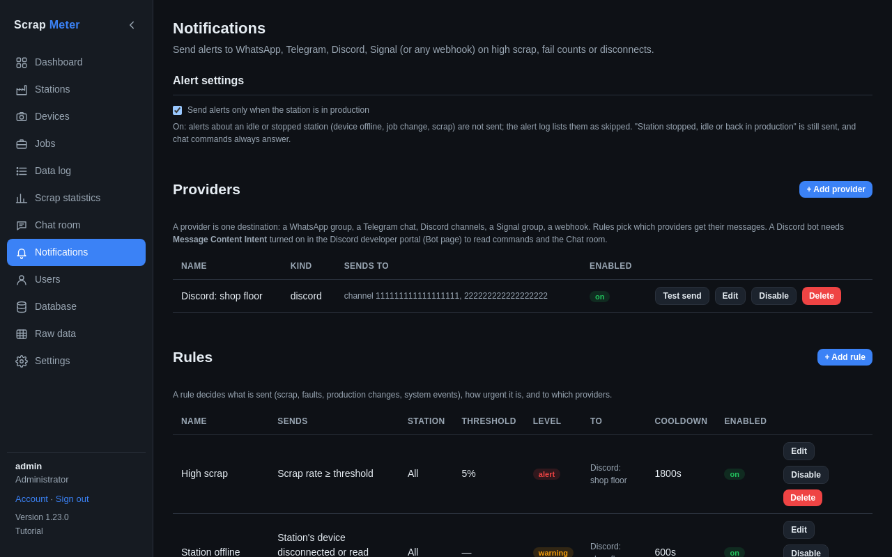
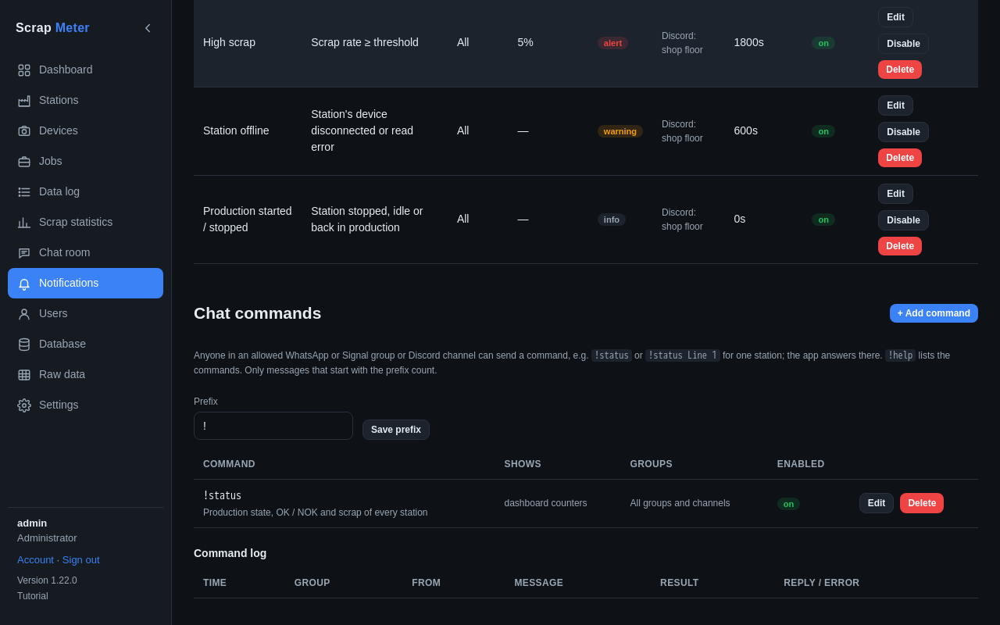

# Notifications and commands

The Notifications tab (permission *manage_notifications*) has alert
settings and three parts.

**Alert settings**: with *Send alerts only when the station is in
production* on (the default), a station that is idle or stopped sends no
alerts, for example when a camera disconnects after the shift. The alert log
at the bottom lists them as *skipped*. "Station stopped, idle or back in
production" is still sent and chat commands always answer.

**Providers** are where messages go: Discord channels (a bot, or a webhook
that only sends), Telegram chats, a webhook, and with the
[developer options](settings.md#developer-options) a WhatsApp or Signal group
linked through a phone. **Test send** tries one.

**Rules** decide what is sent and to which providers: high scrap (with
thresholds per station), NOK count, a device offline, production started or
stopped, job changes, backups and app updates. Each has a level and a
cooldown.

**Chat commands** answer in groups and channels: `!status` shows every
station's state, OK, NOK and scrap; `!status Line 1` only that station;
`!mute Line 1` mutes its alerts until the job changes; `!help` lists them.

More: [Notifications](../notifications.md).
