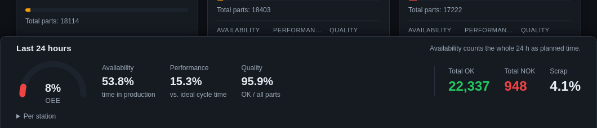

# OEE

OEE = availability × performance × quality, over the last 24 hours:

- **Availability**: time in production out of 24 hours.
- **Performance**: the ideal time of the pieces made (the job's cycle time)
  out of the time in production.
- **Quality**: OK out of all pieces.

The bar at the bottom of the dashboard shows the overall meter and the totals;
**Per station** opens each station's figures. Each dashboard block also shows
its own three figures and the actual cycle time against the set one. Jobs
without a cycle time leave performance out and are named.

More: [OEE](../user-guide.md#oee).
