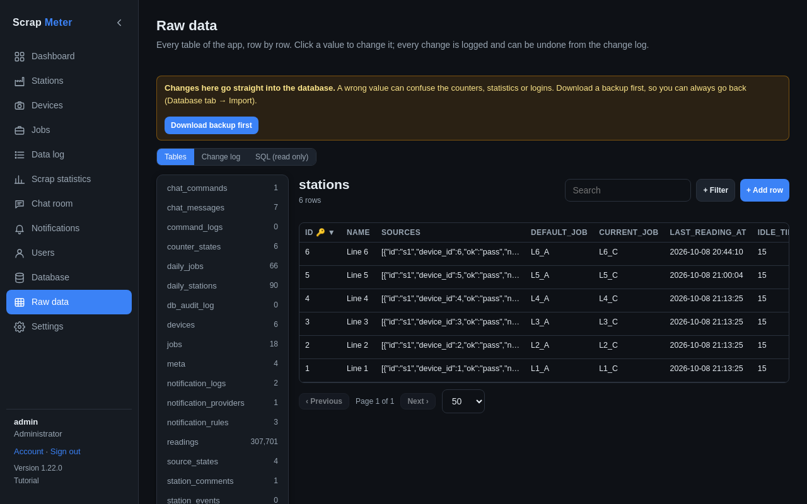

# Raw data

Administrators can look at every table of the app and fix single values
without a database tool.

Pick a table, search and filter, click a value to change it, add or delete
rows, and run read-only SQL. Every change is logged. **Download backup
first**: changes go straight into the database.

More: [Raw data tab](../user-guide.md#raw-data-tab).
