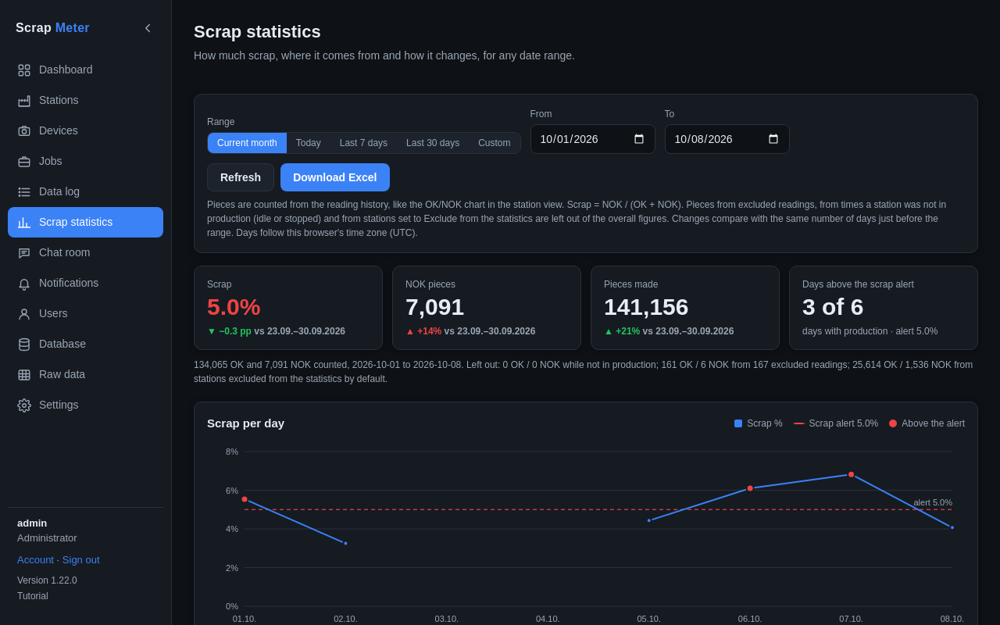
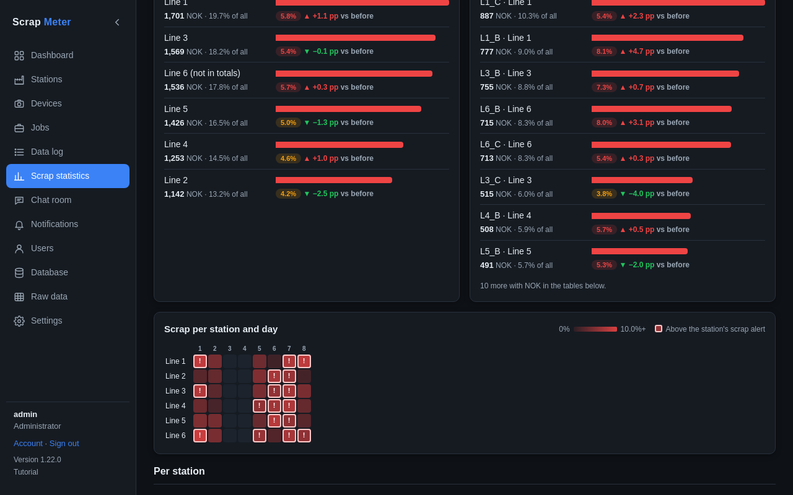

# Scrap statistics

Pick a range of days to see scrap, NOK and pieces made, compared with the
period before, with a trend against your scrap alert.

Below: the stations and jobs with the most NOK, a station by day map that
marks the days above the alert, and tables per day, station and job.

Only parts made **in production** count; excluded readings and stations set
to *Exclude* are left out and listed separately. **Download Excel** saves
the same figures.

More: [Scrap statistics](../user-guide.md#scrap-statistics).
