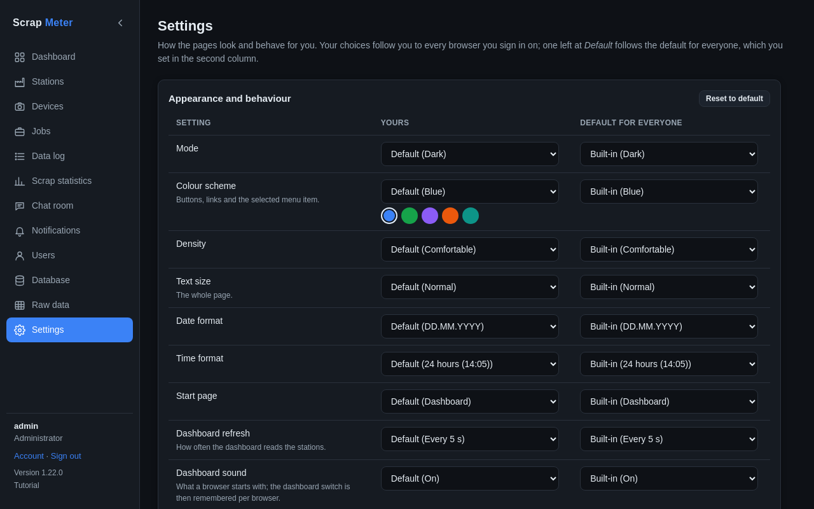
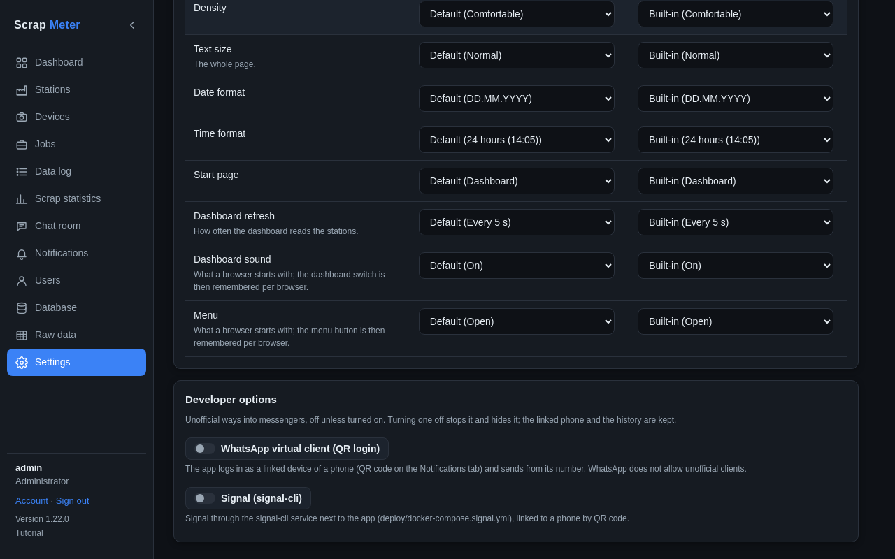

# Settings and developer options

**Settings** (last item in the menu) is for every user: how the pages look
and behave for you. Your choices follow you to every browser.

Mode (dark, light, as the system), colour scheme, density, text size, date
and time format, the start page after signing in, the dashboard refresh and
sound, and a folded menu. *Default* follows the default for everyone, which
administrators set in the second column. **Reset to default** clears your own
choices.

## Developer options

Administrators also see the **Developer options**: unofficial ways into
messengers, off unless turned on.

- **WhatsApp virtual client (QR login)**: the app logs in as a linked device
  of a phone and sends from its number.
- **Signal (signal-cli)**: Signal through a small service next to the app.

Turning one off stops and hides it; the linked phone and the history stay.

More: [Settings tab](../user-guide.md#settings-tab).
