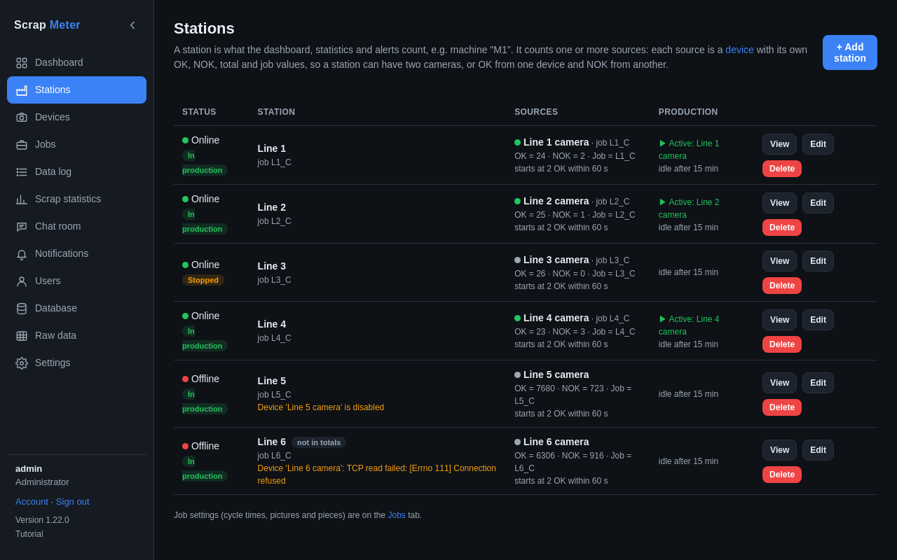
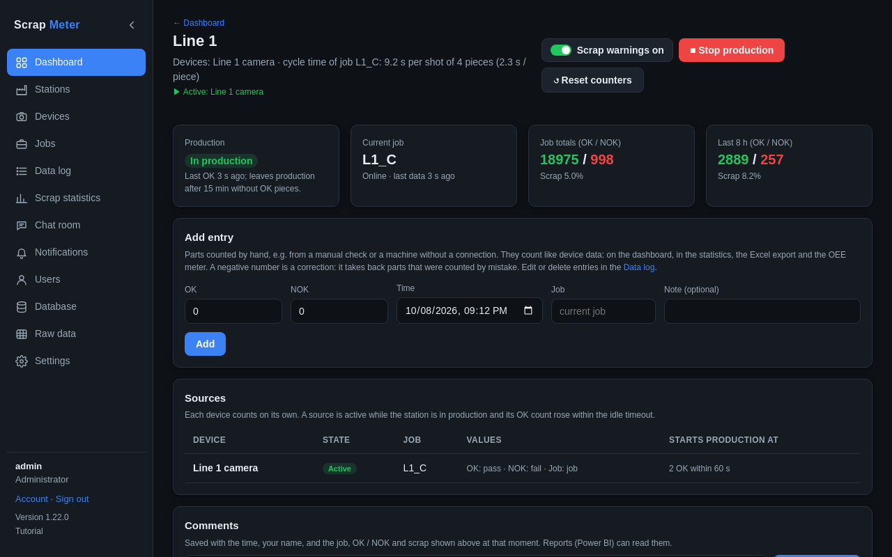
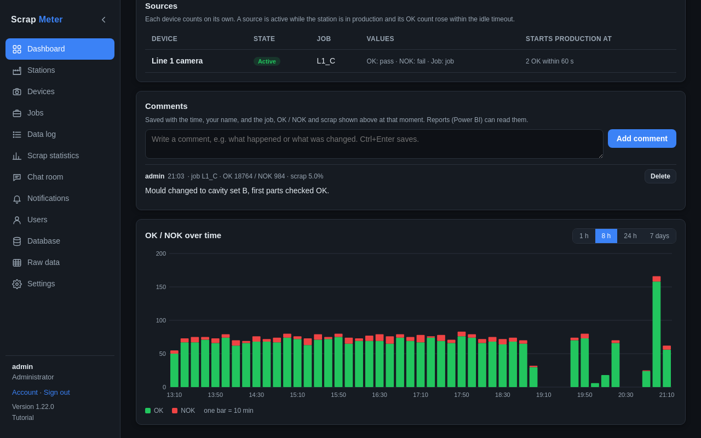

# Stations

A station is what is counted, for example machine "Line 1". The Stations tab
lists them; users with *manage_devices* add and edit them.

A station has:

- **Sources**: one per device it reads, each with the device's value for the
  OK count, the NOK count, an optional total and an optional job. Two cameras
  on one machine are two sources.
- **Starts production at**: e.g. 2 OK pieces within 60 seconds.
- **Idle timeout**: minutes without a new OK piece before it leaves
  production (30 by default).
- **Statistics**: *Include*, or *Exclude* for a test rig that should stay out
  of the totals.

## Station view

Click a station on the dashboard. The station view shows its production
state, current job, counters, its sources, comments and an OK / NOK chart
over 1 hour to 7 days.

- **Stop production / Start production** by hand.
- **Reset counters** sets the dashboard counters of the current job to zero
  (the history stays).
- **Scrap warnings** switch: mute this station's alerts.
- **Add entry**: parts counted by hand, see [Manual entries](manual-entries.md).
- **Comments**: what happened, saved with the time, your name and the counts.

More: [Stations tab](../user-guide.md#stations-tab),
[Production state](../user-guide.md#production-state).
