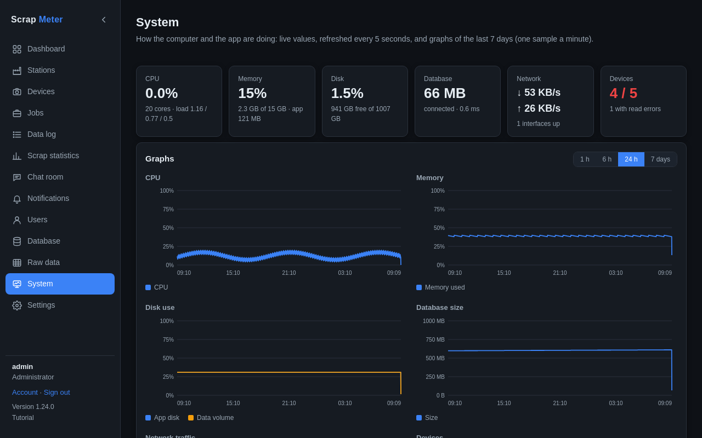

# System

Administrators see how the computer and the app are doing on the *System*
tab, above Settings.

The tiles show CPU, memory, disk, the database size, network traffic and the
devices online, refreshed every 5 seconds. The graphs below go back up to
7 days (one sample a minute): pick 1 h, 6 h, 24 h or 7 days and hover a line
for its values. Further down: the system and app versions and uptime, the
database, disks, network interfaces, the ports devices listen on, and the
poller with any read errors.

In Docker the values are the ones the app's container sees.

More: [System tab](../user-guide.md#system-tab).
