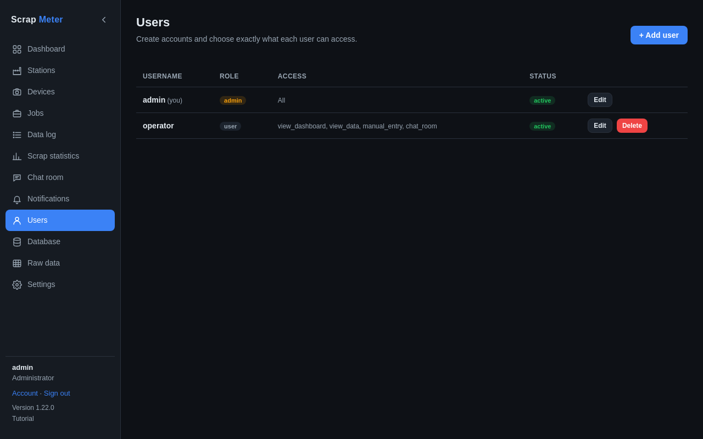

# Users and permissions

Users with *manage_users* create users on the Users tab. A user is an
**administrator** (everything) or has a set of permissions.

| Permission | Allows |
|---|---|
| view_dashboard | dashboard, stations, devices, jobs, comments |
| manage_devices | add and edit devices, stations and jobs |
| control_connections | poll devices, start / stop production, reset counters |
| view_data | Data log and Scrap statistics |
| exclude_readings | exclude or include readings |
| manual_entry | add, edit and delete manual entries |
| manage_notifications | providers, rules and chat commands |
| chat_room | read and write in the Chat room |
| manage_users | create users and set their permissions |

Everyone can change their own password under **Account** and their own
[Settings](settings.md).

More: [Users and permissions](../user-guide.md#users-and-permissions).
